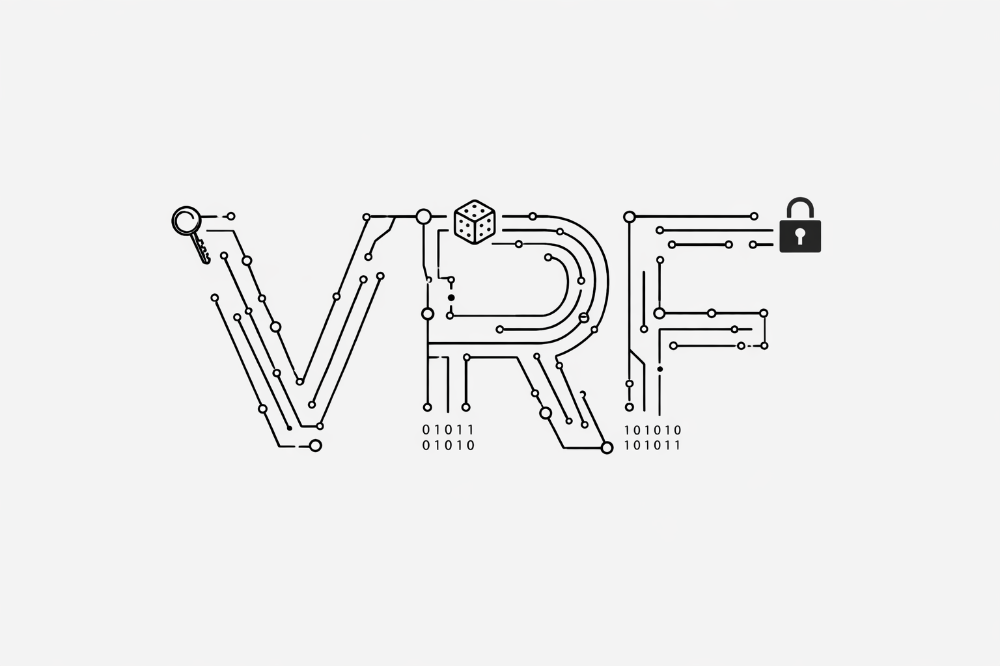

# VRF-Research-Archive

<p align="center">
  
</p>

A research archive for **Verifiable Random Functions (VRFs)** with emphasis on **post-quantum (PQ)** cryptographic constructions, applications, and analysis. This repository acts as a personal and academic archive of VRF-related literature, notes, and experimental prototypes.

---

## Status & Scope

[](#)
[](#)
[](#)
[](#)
[](#license)

This archive consolidates:

* foundational VRF literature,
* VRF variants and extensions,
* post-quantum approaches,
* prototype implementations (reference quality), and
* benchmark methodology for classical vs PQ VRFs.

The primary goal is to maintain a structured, evolving archive of VRF-related research artifacts and lightweight prototypes.

---

## Objectives

The objective of this archive is to consolidate material related to Verifiable Random Functions, with specific interest in post-quantum directions. The repository emphasizes clarity, reproducibility, and exploratory experimentation rather than production engineering. The archive enables the aggregation of definitions, conceptual notes, literature observations, and lightweight prototype code in a format suitable for continuous research.

## Research Areas

### Foundations

Foundational aspects pertain to the formal definition and structure of Verifiable Random Functions as introduced in classical literature. This includes the relationship between VRFs and pseudorandom functions, the mechanism by which uniqueness and verifiability are achieved, and the algebraic settings supporting classical VRF constructions such as RSA-based, Diffie–Hellman, and pairing-based schemes. Foundational discussions also extend to system scenarios where VRFs provide verifiable randomness for leader election, cryptographic beacons, or credentialing.

### Variants

VRF variations expand the basic primitive to accommodate additional constraints or operational environments. These include anonymous or key-private VRFs in which the evaluator’s identity is concealed; constrained VRFs that limit evaluability to subsets of inputs; and threshold or multi-party VRFs where evaluation may be shared across mutually distrusting entities. Further variations examine composability, simulation, and lower-bound considerations from a theoretical perspective, particularly in cryptographic settings that require robust proof frameworks.

### Post-Quantum Directions

Post-quantum considerations assess the security of VRFs under adversaries equipped with quantum computational capabilities. PQ VRFs explore hardness assumptions rooted in lattice-based cryptography, such as LWE and SIS, or symmetric-primitive approaches tailored to resist quantum attacks. Research in this area evaluates trade‑offs such as parameter growth, proof sizes, and performance constraints, particularly in settings involving randomness beacons, distributed protocols, and stake‑based sortition systems.

## Tooling & Methodology

* **Python** as the primary language for VRF prototyping, quick experimentation, and benchmarking.
* **Jupyter/Notebooks** for exploratory work and informal derivations.
* **Lightweight scientific stack** (e.g., NumPy, SymPy, optional SageMath) for algebraic and lattice-style experiments.
* **LaTeX** for structured notes and documentation when needed.

Optional Python environment:

```bash
python -m venv venv
source venv/bin/activate
```

---

## Research Progress

Research within the archive advances gradually and reflects the accumulation of literature notes, experimental code, and conceptual observations. Classical VRF constructions, PQ variants, and system-level deployments will be documented as understanding develops. Experimental implementations and benchmarking scripts written in Python serve as instruments for investigation rather than optimized cryptographic artifacts.

## References

[1] S. Micali, M. Rabin, and S. Vadhan, “Verifiable Random Functions,” in *Proc. IEEE FOCS*, 1999.  
Available: https://people.csail.mit.edu/silvio/Selected%20Scientific%20Papers/Pseudo%20Randomness/Verifiable_Random_Functions.pdf

[2] A. Lysyanskaya, “Unique Signatures and Verifiable Random Functions from the DH–DDH Separation,” in *CRYPTO*, 2002.  
DOI: https://doi.org/10.1007/3-540-45708-9_38

[3] Y. Dodis and A. Yampolskiy, “A Verifiable Random Function with Short Proofs and Keys,” in *PKC*, 2005.  
Available: https://cs.nyu.edu/~dodis/ps/short-vrf.pdf

[4] D. Hofheinz and S. Jager, “Verifiable Random Functions from Standard Assumptions,” in *TCC*, 2016.  
DOI: https://doi.org/10.1007/978-3-662-49096-9_14

[5] G. Fuchsbauer, “Constrained Verifiable Random Functions,” in *SCN*, 2014.  
DOI: https://doi.org/10.1007/978-3-319-10879-7_7

[6] Y. Gilad et al., “Algorand: Scaling Byzantine Agreements for Cryptocurrencies,” in *Proc. ACM SOSP*, 2017.  
Available: https://people.csail.mit.edu/nickolai/papers/gilad-algorand.pdf

[7] A. Brunetta, Y. Liang, and A. Mitrokotsa, “Lattice-Based Simulatable VRFs: Challenges and Future Directions,” *Journal of Information Processing Systems (JISIS)*, 2018.  
Available: https://isyou.info/jisis/vol8/no4/jisis-2018-vol8-no4-04.pdf

[8] M. Esgin et al., “Practical Post-Quantum Verifiable Random Function with Applications to Algorand,” in *Financial Cryptography and Data Security (FC)*, 2021.  
DOI: https://doi.org/10.1007/978-3-662-64331-0_29

[9] B. Li et al., “Simulatable Verifiable Random Function from the LWE Assumption,” *Theoretical Computer Science*, 2023.  
DOI: https://doi.org/10.1016/j.tcs.2023.02.006

[10] A. Bodaghi and R. Safavi-Naini, “Breaking X-VRF,” in *Financial Cryptography and Data Security (FC)*, 2024.  
Available: https://www.ifca.ai/fc24/preproceedings/213.pdf

## License

This archive is released under the **MIT License**. A full copy of the license is available at:

[MIT License](https://opensource.org/licenses/MIT)

---

> VRF-Research-Archive — Verifiable randomness, rigorously archived and explored.
